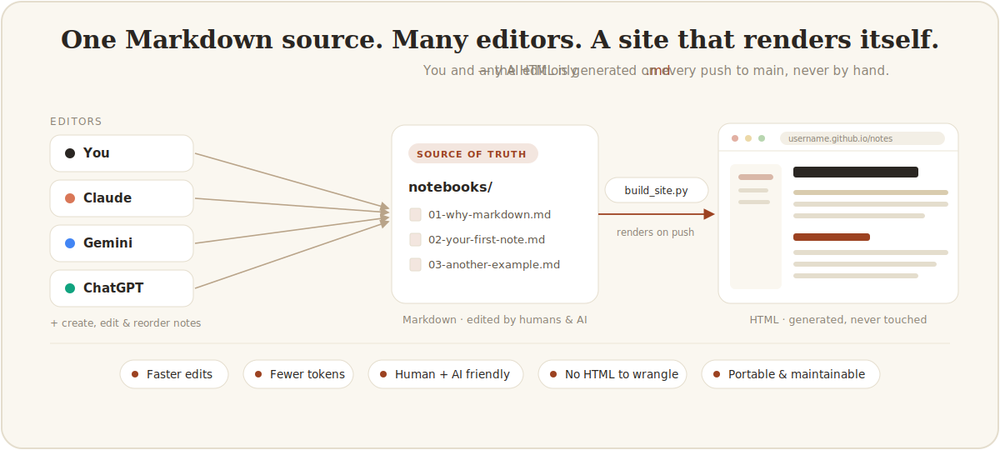

# MD NOTES TO PAGES

<p align="center">
  
</p>

Write notes in Markdown, get a published HTML site. You only need to edit `.md`. Allow access to this repo to any AI. On every push to `main`, the notes are rendered and deployed to GitHub Pages automatically.

I created this repo to keep Markdown as the source of truth and treat the website as a generated artifact. If you want the reasoning behind that, and take a look at the final results, see the published notebook [here](https://meghdadfar.github.io/md-notes-to-pages/index.html). 

Mostly that editing Markdown is faster, cheaper in tokens, and easier for both me and any AI working in the repo. It became an optimized setup to let multiple AI work on notes collaboratively with me.

## How It Works

On every push to `main`, a Python script (`scripts/build_site.py`) finds every `*.md` file in the `notebooks/` directory, sorted by filename, and renders each one to HTML.

The first notebook is used as `index.html` representing the home of your notebook, while the rest keep their names representing the rest of the pages of your notebook.

In the Markdown:

- The first `# Heading` becomes the page title and sidebar label.
- Each `## Heading` becomes a table-of-contents entry.

To reorder pages, rename the files. Numeric prefixes (`01-`, `02-`, ...) work well.

## Requirements

- **Git** — for version control and pushing to GitHub.
- **A GitHub account** — to host the repo and publish the site.
- **Python 3.9 or newer** — only for the optional [local preview](#preview-locally-optional); GitHub builds the published site for you. Dependencies are pinned in [`requirements.txt`](requirements.txt) (`markdown`, `Pygments`).

## Get Started

Get your own copy on GitHub, then clone it:

- **Use this template** (recommended) — click the green button on the top right **Use this template → Create a new repository** for a fresh, unlinked repo.
- **Fork** — for a copy that stays linked to the original.

Then clone the repo locally:

```bash
git clone git@github.com:<your-username>/<your-repo>.git
cd <your-repo>
```

Then open `notebooks/`, replace the sample files with your own (see [Add a Note](#add-a-note)), and [publish to GitHub Pages](#publish-to-github-pages).

## Add a Note

Add a new Markdown file to `notebooks/`, then commit and push — GitHub rebuilds the site and the sidebar and pages update on their own. Use a numeric prefix to control ordering. (To check it before publishing, use the optional [local preview](#preview-locally-optional).)

```markdown
# My topic

A one-sentence description for the page.

## First section

Write here.
```

## Publish to GitHub Pages

You already have your repo on GitHub from [Get Started](#get-started). Publishing is a one-time switch. After it's wired up, every push to `main` redeploys the site automatically.

### 1. Push your notes

```bash
git add .
git commit -m "My notes"
git push
```

### 2. Activate Pages

1. On GitHub, open **Settings → Pages**.
2. Under **Build and deployment**, set **Source → GitHub Actions**.

> ⚠️ Do **not** choose "Deploy from a branch." That mode runs GitHub's default Jekyll build, which publishes your `README.md` as the homepage and ignores this project's workflow — so you'd see only the README, not your notebooks.

### 3. Let the workflow run

The push from step 1 triggers the **Deploy GitHub Pages** workflow ([`.github/workflows/pages.yml`](.github/workflows/pages.yml)). Open the **Actions** tab and wait for the run to go green. It installs dependencies, runs `scripts/build_site.py`, and deploys `_site/`.

Your site is then live at:

```text
https://<your-username>.github.io/<your-repo>/
```

The URL also appears in **Settings → Pages** and on the workflow's `deploy` job. From now on, just push to `main` to publish updates (or trigger the workflow manually from the Actions tab).

## Add AI Collaborators

Because the source is plain Markdown, you can let AI agents read and write notes directly. They work in the repo on your machine, edit only `.md` files, and you commit and push to publish — no one touches HTML.

**The main rules already live in the repo.** [`AGENTS.md`](AGENTS.md) at the root tells any agent what it may touch, edit Markdown in `notebooks/`, never the generated HTML or `_site/` — plus the note format and the build check to run before committing. [`CLAUDE.md`](CLAUDE.md) and [`GEMINI.md`](GEMINI.md) just point to it, so Claude Code, Codex, and Gemini CLI all follow the same conventions automatically. Edit `AGENTS.md` when your own conventions change (a new folder, a different note format); the other two only reference it, so there's a single file to keep current.

**Run an agent inside the repo.** `cd` into this folder and launch any of the supported CLI agents. Each automatically reads its context file — all of which point to `AGENTS.md` — so it follows the same rules from the start:

| Agent | Reads | Launch |
| --- | --- | --- |
| Claude Code | `CLAUDE.md` | `claude` |
| Gemini CLI | `GEMINI.md` | `gemini` |
| Codex CLI | `AGENTS.md` | `codex` |

Then prompt it normally — e.g. *"Add a notebook summarizing X."* It edits Markdown; you review the diff, commit, and push.

**Prefer pull requests?** Connect the GitHub repo through the tool's GitHub integration (the Claude or ChatGPT GitHub app) and have the agent open PRs against `main` instead of editing your local files. Merging a PR runs the same deploy workflow.

## Preview Locally (Optional)

You don't need to build locally — pushing to `main` builds and deploys the site on GitHub. But if you want to check your notes before publishing, render and serve them on your machine:

```bash
# 1. Create an isolated environment and install dependencies
python3 -m venv .venv
.venv/bin/python -m pip install -r requirements.txt

# 2. Render notebooks/*.md into _site/
.venv/bin/python scripts/build_site.py

# 3. Serve the result and open http://localhost:8000
python3 -m http.server 8000 -d _site
```

Rerun step 2 whenever you change a note. `_site/` is generated and Git-ignored, so you never commit it.

## Customize

- Page shell — [`site/templates/page.html`](site/templates/page.html)
- Visual design — [`site/assets/styles.css`](site/assets/styles.css)
- Discovery and rendering — [`scripts/build_site.py`](scripts/build_site.py)

## Acknowledgments

Built collaboratively with [Claude](https://claude.com/claude-code) — fitting, given the project is about making notes easy for humans and AI to co-edit.

## License

[MIT](LICENSE)
